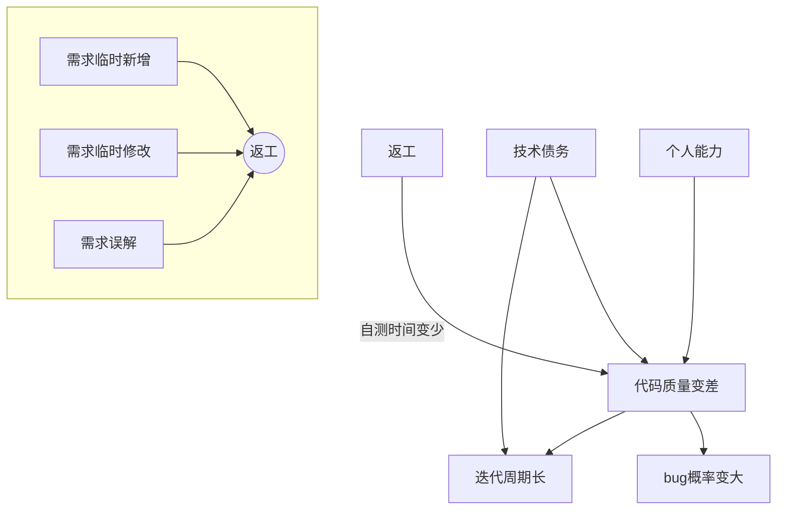

[TOC]


1. ==3W问题==：WHO WHAT WHY。
2. 有理论依据支撑方案，==杜绝伪需求==。了解业务方向对架构设计和预留功能有好处。
3. 能预估效果，有验证方案：比如AB测试、找路人验证==学习成本==是否过高。
4. 应把过半的时间投入到==研究用户==上去，功能不在多在精，80%人只用20%的功能。

##### 绘图


```sequence
起床->吃饭: 稀饭油条
吃饭->上班: 不要迟到了
上班->午餐: 吃撑了
上班->下班:
Note right of 下班: 下班了
下班->回家:
Note right of 回家: 到家了
回家-->>起床:
Note left of 起床: 新的一天
```

##### 字体
<div style='color: red;'>支持html标签和样式</div>

*斜体*  
**粗体**  
***加粗斜体***
~~删除线~~
++下划线++
==背景高亮==
<kbd>kbd</kbd>
<!-- 注释不显示 -->

[超链接](https://www.jianshu.com/u/16d77399d3a7 "择势勤")
我经常去的几个网站[Google][1]、[Leanote][2]。
[1]:http://www.google.com 
[2]:http://www.leanote.com

##### 层级与列表
- 语言
	* 语言
        + 语言
- [ ] 任务一 未做 `- + 空格 + [x]`
- [x] 任务二 已做 `任务列表`
##### 图片居中
<center>  <!--开始居中对齐-->


`格式: `

</center> <!--结束居中对齐-->  

@import "http://zh.mweb.im/asset/img/set-up-git.gif" {width: 10%}

##### 引用
> 引用
注脚[^1]。

[^1]:注脚跳转页底的标记
##### 表格
|表格表格|表格表格|表格表格|
|-|:-:|-:|
|左对齐|居中|右对齐|
```js {cmd=node  output="markdown"} 
console.log(`|表格|表格|表格|`)
console.log(`|-|:-:|-:|`)
for (let i = 0; i < 3; i++) {
    console.log(`${i}|${i+1}|${i+2}`)
}
```
##### 公式   
$$ 1+2=3 $$
```math
E = mc^2
```
```math
x = \dfrac{-b \pm \sqrt{b^2 - 4ac}}{2a} 
```
```math
[\frac{1}{\Bigl(\sqrt{\phi \sqrt{5}}-\phi\Bigr) e^{\frac25 \pi}} =
1+\frac{e^{-2\pi}} {1+\frac{e^{-4\pi}} {1+\frac{e^{-6\pi}}
{1+\frac{e^{-8\pi}} {1+\ldots} } } }]
```

##### 分割线

---


##### 代码输出
```js {cmd=node output="html"} 
console.log(`<div style='color: green;'>js输出html</div>`)
```
```js {cmd=node hide output="markdown"} 
console.log("==js输出markdown源码==")
```
##### PPT
```
<!-- slide -->
被包裹的内容为一页
<!-- slide -->
```
###### @import 导入md文件、图片、代码
@import "PS.md"


