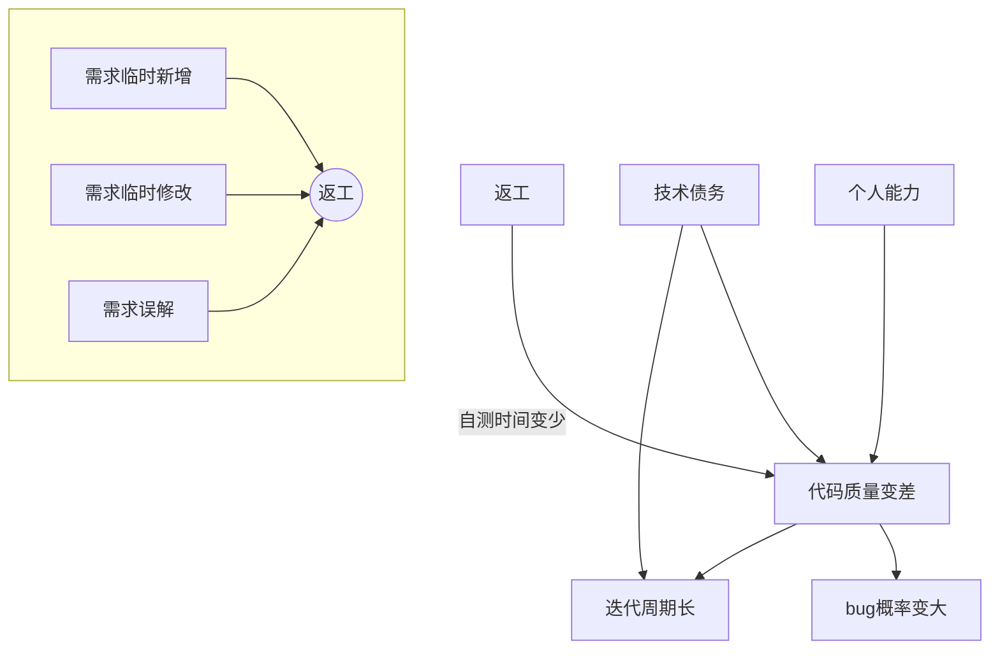

[TOC]

#### 现象
返工多、认知不统一、测试成本高
需求建议表建议数，研发人数最多占比最少
#### 建议
1. 内部人员使用的工具强调使用目标不强调使用体验，拖用三方组件库，怎么==快==怎么来。
2. 逐步建立公司的技术==积累==例如前端UI库，这个要产品规划，做新需求时评估可以复用的，我们就封装，在开启其他需求时可以逻辑迁移。
3. 合理排期，减少临时变动。
    1. 所有需求无论大小都进入统一计划中，稳定能带来==工作节奏==，例如今天状态好加个班多做一点，明天状态差就按时下班。
    2. 认知失调 --> 打击情绪 --> 降低责任感 --> 敷衍了事 --> 隐藏bug增多。只用速度衡量价值的场景只适用外包，表面上发挥了螺丝钉100%的能力，但也让他只能发挥出这样的水平。大公司合理的规则不一定适合初创公司。提高开发效率不是因为它是产品成功的银弹，而是崇尚正确高效专业的==工作氛围==。
4. 合理提需求。
    1. ==3W问题==：WHO WHAT WHY。
    2. 有理论依据支撑方案，==杜绝伪需求==。了解业务方向对架构设计和预留功能有好处。
    3. 能预估效果，有验证方案：比如AB测试、找路人验证==学习成本==是否过高。
    4. 应把过半的时间投入到==研究用户==上去，功能不在多在精，80%人只用20%的功能。
#### 书摘
创业团队努力找到新的投资。大公司则挣扎于复制早期的成功。团队无法持续为业务贡献价值。主管则为新想法何时才能上线操碎了心。工程师对产品经理满腹怨言。
好的团队，保证开发工程师每天有时间参与产品原型的讨论，为做好产品献计献策。差的团队，在迭代计划会上展示原型，一心只为了估出工作量。
好的团队，理解速度和快速迭代对创新的价值，更知道速度来自于正确的方法，而非强制加班。差的团队，抱怨同事工作不够努力，速度太慢。---Marty Cangan
器具之器具存在，即可靠性，按照物的不同方式和范围把一切物聚集于一体。不过，器具的有用性只不过是可靠性的本质后果。有用性在可靠性中漂浮。
对准确性和理性进行鼓励。对分享更多信息的人进行鼓励。数据共享是实现准确性的最佳途径。
多样性是实现高效团体决策的基础，但我们不能低估维持它的难度。
有些事必须先做，且按正确的顺序去做。
系统越是复杂，需要的预热时间越长。
如无必要，勿增实体。


```ditaa {cmd=true}
  +--------+   +-------+    +-------+
    |        | --+ ditaa +--> |       |
    |  Text  |   +-------+    |diagram|
    |Document|   |!magic!|    |       |
    |     {d}|   |       |    |       |
    +---+----+   +-------+    +-------+
        :                         ^
        |       Lots of work      |
        +-------------------------+
```
```js {cmd=node}
// ```js {cmd=node}
console.log('哈哈')
```
<!-- 注释不显示 -->

- [ ] 任务一 未做 `- + 空格 + [x]`
- [x] 任务二 已做 `任务列表`

<div style='color: red;'>
    支持html标签和样式
</div>

*斜体*
**粗体**
***加粗斜体***
~~删除线~~
++下划线++
==背景高亮==

[超链接](https://www.jianshu.com/u/16d77399d3a7 "择势勤")
我经常去的几个网站[Google][1]、[Leanote][2]。
[1]:http://www.google.com 
[2]:http://www.leanote.com


* 无序列表项 一
+ 无序列表项 二
- 无序列表项 三
###### 层级
- 语言
	- 语言  
		- 语言
###### 图片居中
<center>  <!--开始居中对齐-->


`格式: `

</center> <!--结束居中对齐-->  
###### 引用
> 引用
引用

###### 表格
|表格|表格|表格|
|-|:-:|-:|
|1|2|3|
|4|5|6|

###### 公式   
$$ 1+2=3 $$
```math
E = mc^2
```
```math
x = \dfrac{-b \pm \sqrt{b^2 - 4ac}}{2a} 
```
```math
[\frac{1}{\Bigl(\sqrt{\phi \sqrt{5}}-\phi\Bigr) e^{\frac25 \pi}} =
1+\frac{e^{-2\pi}} {1+\frac{e^{-4\pi}} {1+\frac{e^{-6\pi}}
{1+\frac{e^{-8\pi}} {1+\ldots} } } }]
```

###### 分割线

---

注脚[^1], 注脚[^2]。
[^1]:注脚跳转页底的标记
[^2]:注脚防止阅读干扰